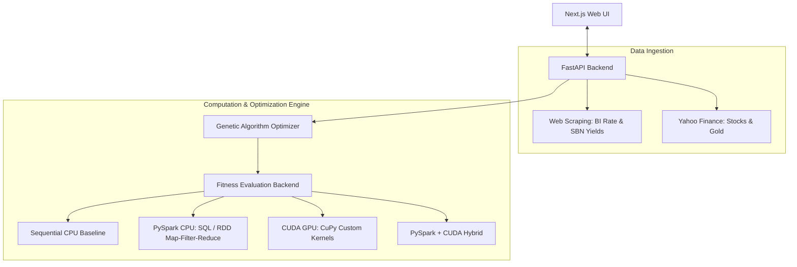

# OptiGene — Parallel Multi-Asset Portfolio Optimizer

OptiGene is an interactive portfolio optimization web application designed to help retail investors allocate capital efficiently across multiple assets (Time Deposits, Government Bonds, Stocks, and Gold). The platform employs a **Genetic Algorithm (GA)** accelerated by high-performance parallel computing frameworks, specifically **PySpark** and **CUDA GPU** architectures.

---

## 🚀 Key Features

* **Dynamic Data Ingestion**: Live web scraping of the Central Bank's BI-Rate (for time deposits) and 10-Year Government SBN Bond yields, combined with historical equity and commodity price retrieval via Yahoo Finance.
* **Genetic Algorithm Engine**: Heuristic portfolio optimization maximizing the **Sharpe Ratio** while strictly enforcing bounds on stock exposure and maximum drawdown penalties based on investor risk profiles (*Safe*, *Balanced*, or *Aggressive*).
* **6-Method Parallel Benchmarks**: Empirical performance comparison demonstrating execution speedup:
  1. *Sequential Python (For Loop)* — CPU baseline
  2. *PySpark SQL Query* — Parallel CPU execution
  3. *PySpark RDD map* — Distributed CPU metrics calculation
  4. *PySpark RDD filter + reduce* — Distributed CPU constraints filter & optimization
  5. *Pure CUDA (GPU via CuPy)* — Massive parallel GPU thread-block execution
  6. *PySpark + CUDA Hybrid* — Distributed partitions evaluated on GPU workers
* **Layman-Friendly Translation**: Seamless conversion of complex financial models (weights, volatility, Sharpe ratios) into exact Rupiah-denominated advice (e.g., *"Invest Rp 8.000.000 in Bonds"*).

---

## 🏗️ System Architecture



---

## 🛠️ Project Structure

```
portfolio-optimizer/
├── frontend/             # Next.js SPA Web App (React, Tailwind CSS, Chart.js)
├── backend/              # FastAPI Python Web API
│   ├── app.py            # API controller & Uvicorn router
│   ├── orchestrator.py   # Main workflow controller
│   ├── formatter.py      # Technical-to-layman translation formatter
│   ├── data/             # Web fetchers, asset validator, & caches
│   ├── pyspark/          # SparkSession config and SQL/RDD operations
│   ├── cuda/             # Raw CUDA C kernels and CPU fallback
│   ├── ga/               # Genetic Algorithm (selection, crossover, mutation)
│   └── benchmark/        # Performance runner module
├── OptiGene_Demo.ipynb   # Interactive Jupyter Notebook Demonstration
└── generate_notebook.py  # Script to regenerate clean notebook template
```

---

## ⚙️ Getting Started & Installation

### Prerequisites
* Python 3.11
* Java 8/11 (required for PySpark)
* NVIDIA GPU with CUDA drivers (optional, for CUDA GPU execution)
* Node.js & npm (for Web Frontend)

### 1. Environment Setup (Conda)
Create and activate the environment using the provided `spark311` configuration:
```bash
conda activate spark311
```

### 2. Install Frontend Dependencies
```bash
cd frontend
npm install
cd ..
```

---

## 🏃 Running the Application

For convenience, startup scripts are provided in the root directory.

### Windows (PowerShell)
Execute the script to start the FastAPI backend and Next.js frontend in separate terminal windows:
```powershell
./run_project.ps1
```

### Windows (CMD / Batch)
```cmd
run_project.bat
```

* Access the **Web Frontend** at: `http://localhost:3000`
* Access the **Backend API** at: `http://127.0.0.1:5000`

---

## 📓 Running the Notebook Demo
To test or present the system interactively, open the Jupyter Notebook:
1. Open the workspace in your IDE or launch Jupyter Lab.
2. Select the `spark311` Python kernel.
3. Open and run all cells in [OptiGene_Demo.ipynb](file:///d:/INFORMATICS/SEMESTER%204/PARALLEL%20PROCESSING/Spark/OptiGene_Demo.ipynb) to view performance graphs and optimization results.
